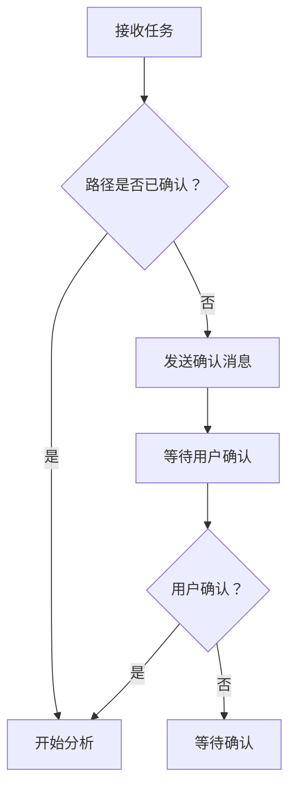

# 手动推送指南

## 当前状态

✅ 技能文件已创建：
- `confirm-before-analyze/SKILL.md` - 逆向前确认目录技能
- `README.md` - 项目说明文档

✅ Git 提交已完成：
- Commit: `fb3cc1d` 
- Message: "feat: 新增 confirm-before-analyze 技能（逆向前确认目录）"

⚠️ 推送失败原因：需要 GitHub 认证

---

## 推送方案

### 方案 1: 使用 GitHub Desktop（推荐）

1. 打开 GitHub Desktop
2. File → Add Local Repository → 选择目录：
   ```
   C:\Users\zhao.mengkang\.openclaw\workspace-legacy-code-reader-agent\tmp_skills_repo
   ```
3. 点击 "Push origin" 按钮

### 方案 2: 使用 Git 命令行 + Personal Access Token

1. 生成 Personal Access Token：
   - 访问 https://github.com/settings/tokens
   - 点击 "Generate new token (classic)"
   - 勾选 `repo` 权限
   - 生成并复制 token

2. 使用 token 推送：
   ```bash
   cd C:\Users\zhao.mengkang\.openclaw\workspace-legacy-code-reader-agent\tmp_skills_repo
   git push https://<your-username>:<your-token>@github.com/kangkangsk/agent-skills-code2md.git main
   ```

### 方案 3: 配置 SSH Key

1. 生成 SSH Key（如果没有）：
   ```bash
   ssh-keygen -t ed25519 -C "your_email@example.com"
   ```

2. 添加 SSH Key 到 GitHub：
   - 访问 https://github.com/settings/keys
   - 点击 "New SSH key"
   - 粘贴 `~/.ssh/id_ed25519.pub` 内容

3. 修改 remote URL 为 SSH：
   ```bash
   cd C:\Users\zhao.mengkang\.openclaw\workspace-legacy-code-reader-agent\tmp_skills_repo
   git remote set-url origin git@github.com:kangkangsk/agent-skills-code2md.git
   git push -u origin main
   ```

### 方案 4: 使用 Git Credential Manager

1. 清除现有凭证：
   ```bash
   git credential-manager erase
   ```

2. 再次推送（会弹出登录窗口）：
   ```bash
   cd C:\Users\zhao.mengkang\.openclaw\workspace-legacy-code-reader-agent\tmp_skills_repo
   git push -u origin main
   ```

---

## 验证推送成功

推送成功后，访问以下链接验证：
https://github.com/kangkangsk/agent-skills-code2md

应该能看到：
- ✅ README.md
- ✅ confirm-before-analyze/SKILL.md
- ✅ 最新的 commit 记录

---

## 后续步骤

推送成功后，可以清理临时目录：
```bash
cd C:\Users\zhao.mengkang\.openclaw\workspace-legacy-code-reader-agent
rmdir /s tmp_skills_repo
```

---

## 技能内容摘要

### confirm-before-analyze 技能

**核心功能**: 在逆向工程分析前，强制与用户确认代码目录和文档输出目录

**主要特点**:
- 📁 确认代码目录路径
- 📂 确认文档输出目录路径
- ✅ 用户明确确认后才开始分析
- ⚠️ 完善的路径验证和错误处理
- 📋 标准确认模板

**适用场景**:
- 所有逆向工程任务
- 代码分析任务
- 文档生成任务

**工作流程**:


**标准确认模板**:
```markdown
收到！在开始逆向分析之前，请确认以下信息：

📁 **代码目录**: `<路径>`
   - 请确认这是需要分析的完整代码库路径
   
📂 **文档输出目录**: `<路径>/docs`（默认）
   - 请确认文档输出位置

✅ 确认后我将立即开始...
```

---

**创建时间**: 2026-03-19 12:50  
**创建者**: Legacy Code Reader Agent
