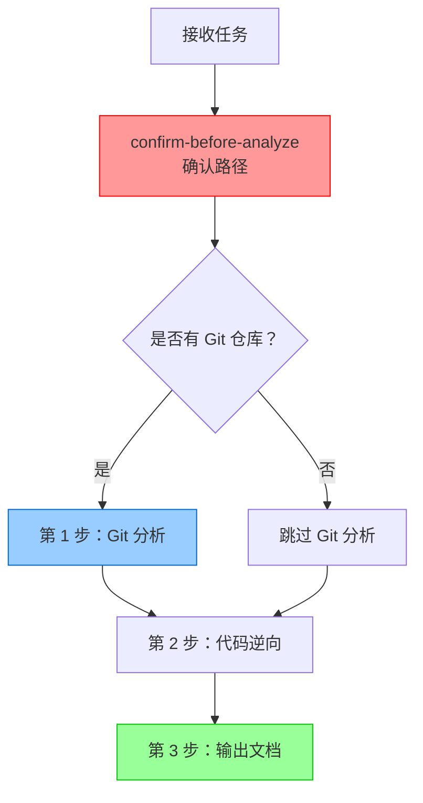
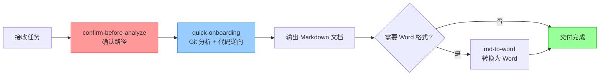

# OpenClaw Skills - 代码逆向工程技能集

智能体技能仓库 - 用于代码逆向工程、文档生成和项目快速上手

## 📦 技能列表

### 1. confirm-before-analyze (逆向前确认目录) v1.0

**位置**: `confirm-before-analyze/SKILL.md`

**描述**: 在执行逆向工程分析之前，必须与使用者双向确认代码目录和文档输出目录

**核心原则**:
- 📁 确认代码目录
- 📂 确认文档输出目录
- ✅ 用户确认后才开始分析

**适用场景**:
- 所有逆向工程任务
- 代码分析任务
- 文档生成任务

**标准确认模板**:
```markdown
收到！在开始逆向分析之前，请确认以下信息：

📁 **代码目录**: `<用户提供的路径>`
   - 请确认这是需要分析的完整代码库路径
   
📂 **文档输出目录**: `<用户提供的路径>/docs`（默认）
   - 请确认文档输出位置

✅ 确认后我将立即开始...
```

📖 **详细文档**: [confirm-before-analyze/SKILL.md](confirm-before-analyze/SKILL.md)

---

### 2. quick-onboarding (存量项目快速上手) v2.0 ⭐

**位置**: `quick-onboarding/`

**描述**: 专门针对存量项目的逆向解析技能，**强制要求先分析 Git 提交记录了解近半年功能迭代**，然后进行代码逆向解析

**核心原则**:
- ⭐ Git 分析前置（强制）
- 🔄 双轮驱动分析（Git+ 代码）
- 📋 输出 3 份文档（v2.0 标准）

**工作流程**:


**输出文档**:
1. 《近半年功能迭代分析报告》（基于 Git）
2. 《快速上手卡片》v2.0（标注新增功能）
3. 《项目快速上手与架构还原说明书》v2.0（包含迭代历史）

**质量标准**:
- ⏱️ **时间**: 30 分钟内完成（Git 分析 10 分钟 + 代码逆向 20 分钟）
- ✅ **强制**: 必须先输出 Git 分析报告
- 🔥 **标注**: 所有功能和模块必须标注新增时间
- ⚠️ **风险**: 基于 Git 证据识别潜在风险

📖 **详细文档**: [quick-onboarding/README.md](quick-onboarding/README.md)  
📄 **技能规范**: [quick-onboarding/SKILL.md](quick-onboarding/SKILL.md)  
📝 **文档模板**: [quick-onboarding/templates/](quick-onboarding/templates/)

---

## 🛠️ 使用规范

### 标准调用顺序



### 最佳实践

1. **始终先确认路径** - 使用 `confirm-before-analyze` 技能
2. **Git 分析前置** - 有 Git 仓库时必须先分析
3. **标注新增功能** - 在文档中区分传统功能和新增功能
4. **风险识别** - 基于 Git 证据识别潜在风险
5. **优先级排序** - 重构建议按 P0/P1/P2/P3 排序

---

## 📝 文档模板

`quick-onboarding` 技能提供标准文档模板：

### 模板 1: 近半年功能迭代分析报告

**用途**: Git 提交记录分析报告  
**位置**: `quick-onboarding/templates/近半年功能迭代分析报告.md`  
**包含章节**:
- 迭代概览（提交统计、主要需求清单）
- 月度迭代节奏
- TOP 5 重点需求详细分析
- 功能演进趋势
- 技术架构演进
- 代码质量分析
- 发展建议

### 模板 2: 项目快速上手与架构还原说明书

**用途**: 完整的项目架构文档  
**位置**: `quick-onboarding/templates/项目快速上手与架构还原说明书.md`  
**包含章节**:
- 近半年功能迭代概览
- 项目概述
- 技术架构
- 核心业务逻辑
- 数据持久化层
- 外部依赖
- 典型业务流程
- 代码质量评估
- 风险识别与重构建议

**使用方法**:
```bash
# 复制模板到项目 docs 目录
cp quick-onboarding/templates/近半年功能迭代分析报告.md <项目路径>/docs/
cp quick-onboarding/templates/项目快速上手与架构还原说明书.md <项目路径>/docs/

# 填充实际内容
```

---

## 🔧 其他工具技能

### md-to-word (Markdown 转 Word)

**描述**: 将 Markdown 格式的文档转换为 Word (.docx) 格式

**适用场景**:
- 需要将分析报告转换为 Word 格式
- 需要更好的编辑和分享能力

### interface-converter (接口转换器)

**描述**: 接口代码语言转换工具

**适用场景**:
- Java ↔ Python 接口代码转换
- 不同语言间的接口适配

---

## 📚 快速开始

### 场景 1: 新成员接手存量项目

```
用户：快速上手分析 <项目路径>

智能体:
1. confirm-before-analyze: 确认代码目录和文档输出目录
2. quick-onboarding 第 1 步：Git 提交记录分析（近半年）
3. quick-onboarding 第 2 步：基于 Git 分析的代码逆向
4. quick-onboarding 第 3 步：输出 3 份文档

交付物:
- 《近半年功能迭代分析报告》
- 《快速上手卡片》v2.0
- 《项目快速上手与架构还原说明书》v2.0
```

### 场景 2: 代码分析任务

```
用户：逆向解析 <项目路径>

智能体:
1. confirm-before-analyze: 确认路径
2. quick-onboarding: 执行完整分析流程
3. 输出文档到指定目录
```

### 场景 3: 需要 Word 格式报告

```
用户：分析 <项目路径> 并生成 Word 文档

智能体:
1. confirm-before-analyze: 确认路径
2. quick-onboarding: 生成 Markdown 文档
3. md-to-word: 转换为 Word 格式
4. 交付 Markdown + Word 双格式文档
```

---

## 🤝 贡献指南

### 添加新技能

1. 在根目录创建技能文件夹：`<skill-name>/`
2. 创建以下文件：
   - `SKILL.md` - 技能规范（必需）
   - `README.md` - 使用说明（推荐）
   - `templates/` - 文档模板（可选）
3. 更新本 `README.md`，添加技能说明
4. 提交 Pull Request

### SKILL.md 模板

```markdown
# <技能名称> (<SkillName>) v1.0

## 技能描述
一句话描述技能用途

## 核心原则
- 原则 1
- 原则 2

## 工作流程
详细说明执行步骤

## 质量标准
定义质量要求和检查清单

## 故障排查
常见问题和解决方案

## 维护者
姓名和更新日期
```

---

## 📊 技能对比

| 技能 | 深度 | 时间 | 输出 | 适用场景 | 前置条件 |
|------|------|------|------|----------|----------|
| **confirm-before-analyze** | ⭐ | <1 分钟 | 确认消息 | 所有逆向任务 | 无 |
| **quick-onboarding** | ⭐⭐ | 30 分钟 | 3 份文档 | 新人入门、项目交接 | **必须先分析 Git** |
| **md-to-word** | ⭐ | 1 分钟 | Word 文档 | 格式转换 | Markdown 源文件 |
| **interface-converter** | ⭐⭐ | 5 分钟 | 转换后代码 | 接口代码语言转换 | 接口源代码 |

---

## 📞 维护信息

**主要维护者**: Legacy Code Reader Agent  
**GitHub**: https://github.com/kangkangsk/openclaw-skills  
**许可证**: MIT License

---

## 📅 更新记录

| 日期 | 版本 | 更新内容 |
|------|------|----------|
| 2026-03-19 | v1.0 | **初始发布**：<br/>- 新增 confirm-before-analyze 技能<br/>- 新增 quick-onboarding 技能 v2.0<br/>- 提供标准文档模板<br/>- 完善使用规范和最佳实践 |

---

**最后更新**: 2026-03-19  
**当前版本**: v1.0
