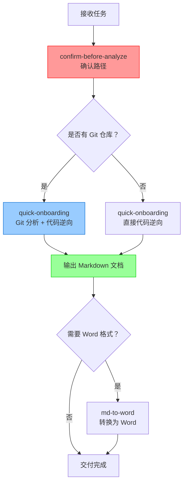

# Agent Skills - Code to Markdown

智能体技能仓库 - 用于代码逆向工程和文档生成

## 技能列表

### 1. confirm-before-analyze (逆向前确认目录) v1.0

**描述**: 在执行逆向工程分析之前，必须与使用者双向确认代码目录和文档输出目录

**核心原则**:
- 📁 确认代码目录
- 📂 确认文档输出目录
- ✅ 用户确认后才开始分析

**适用场景**:
- 所有逆向工程任务
- 代码分析任务
- 文档生成任务

**使用方法**:
```markdown
用户：逆向解析 <项目路径>

智能体：收到！在开始逆向分析之前，请确认以下信息：

📁 **代码目录**: `<项目路径>`
   - 请确认这是需要分析的完整代码库路径
   
📂 **文档输出目录**: `<项目路径>/docs`（默认）
   - 请确认文档输出位置

✅ 确认后我将立即开始...
```

### 2. quick-onboarding (快速上手) v2.0

**描述**: 专门针对存量项目的逆向解析技能，强制要求先分析 Git 提交记录

**核心原则**:
- ⭐ Git 分析前置（强制）
- 📊 双轮驱动分析（Git+ 代码）
- 📋 输出 3 份文档（v2.0 标准）

**工作流程**:
1. Git 提交记录分析（近半年功能迭代）
2. 基于 Git 分析的代码逆向
3. 输出最终文档

**输出文档**:
- 《近半年功能迭代分析报告》
- 《快速上手卡片》v2.0
- 《项目快速上手与架构还原说明书》v2.0

### 3. md-to-word (Markdown 转 Word)

**描述**: 将 Markdown 格式的文档转换为 Word (.docx) 格式

**适用场景**:
- 需要将分析报告转换为 Word 格式
- 需要更好的编辑和分享能力

### 4. interface-converter (接口转换器)

**描述**: 接口代码语言转换工具

**适用场景**:
- Java ↔ Python 接口代码转换
- 不同语言间的接口适配

---

## 使用规范

### 技能调用顺序



### 最佳实践

1. **始终先确认路径** - 使用 `confirm-before-analyze` 技能
2. **Git 分析前置** - 有 Git 仓库时必须先分析
3. **标注新增功能** - 在文档中区分传统功能和新增功能
4. **风险识别** - 基于 Git 证据识别潜在风险
5. **优先级排序** - 重构建议按 P0/P1/P2/P3 排序

---

## 贡献指南

### 添加新技能

1. 在根目录创建技能文件夹：`<skill-name>/`
2. 创建 `SKILL.md` 文件，包含：
   - 技能描述
   - 工作流程
   - 质量标准
   - 故障排查
3. 更新本 README.md，添加技能说明
4. 提交 Pull Request

### SKILL.md 模板

```markdown
# <技能名称> (<SkillName>) v1.0

## 技能描述
一句话描述技能用途

## 核心原则
- 原则 1
- 原则 2

## 工作流程
详细说明执行步骤

## 质量标准
定义质量要求和检查清单

## 故障排查
常见问题和解决方案

## 维护者
姓名和更新日期
```

---

## 模板使用

本仓库提供标准文档模板，位于 `templates/` 目录：

- `近半年功能迭代分析报告.md` - Git 分析报告模板
- `项目快速上手与架构还原说明书.md` - 完整架构文档模板

使用时复制模板并填充实际内容。

---

## 维护者

**主要维护者**: Legacy Code Reader Agent  
**GitHub**: https://github.com/kangkangsk/agent-skills-code2md

## 许可证

MIT License
