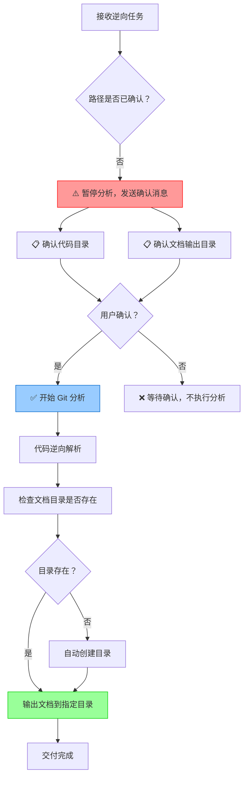

# 逆向前确认目录技能 (Confirm Before Analyze Skill) v1.0

## 技能描述
在执行逆向工程分析任务之前，**必须与使用者双向确认代码目录和文档输出目录**，确保路径准确无误，避免因路径错误导致的返工和时间浪费。

## ⚠️ 核心原则

### 双向确认原则（强制）⭐⭐⭐
**在开始任何逆向分析工作之前，必须先与使用者确认以下两个关键信息：**

1. 📁 **代码目录** - 需要分析的完整代码库路径
2. 📂 **文档输出目录** - 分析结果文档的输出位置

### 为什么需要确认？
- ✅ 避免路径拼写错误导致分析失败
- ✅ 确保文档输出到用户期望的位置
- ✅ 防止覆盖已有文档或输出到错误目录
- ✅ 提高交付准确性和用户满意度
- ✅ 减少沟通成本和返工时间

---

## 工作流程（强制顺序）



---

## 标准确认模板

当接收到逆向任务时，立即回复以下内容（不要开始分析）：

```markdown
收到！在开始逆向分析之前，请确认以下信息：

📁 **代码目录**: `<用户提供的路径>`
   - 请确认这是需要分析的完整代码库路径
   - 我将在此目录下查找 Git 仓库和源代码

📂 **文档输出目录**: `<用户提供的路径 或 代码目录/docs>`
   - 请确认文档输出位置
   - 如目录不存在，我将自动创建
   - 默认输出到代码目录下的 docs 子目录

✅ **确认后我将立即开始**：
   1. Git 提交记录分析（近半年功能迭代）
   2. 代码逆向解析
   3. 输出 3 份文档（v2.0 标准）：
      - 《近半年功能迭代分析报告》
      - 《快速上手卡片》v2.0
      - 《项目快速上手与架构还原说明书》v2.0

⏳ **预计耗时**: 5-10 分钟
```

---

## 确认要点

### 1. 代码目录确认

**检查项**:
- [ ] 路径格式是否正确（绝对路径/相对路径）
- [ ] 目录是否存在
- [ ] 目录是否为空
- [ ] 是否包含源代码文件
- [ ] 是否包含 Git 仓库（`.git` 目录）

**验证命令**:
```bash
# 检查目录是否存在
Test-Path "<代码目录>"

# 检查是否为空
Get-ChildItem "<代码目录>" | Measure-Object

# 检查是否有 Git 仓库
Test-Path "<代码目录>\.git"
```

### 2. 文档输出目录确认

**检查项**:
- [ ] 路径格式是否正确
- [ ] 目录是否存在（如不存在将自动创建）
- [ ] 是否有写入权限
- [ ] 是否会覆盖已有文档

**默认规则**:
- 如果用户未指定文档输出目录 → 默认为 `<代码目录>/docs`
- 如果目录不存在 → 自动创建
- 如果目录已存在且有文档 → 不删除已有文档，新增文档

---

## 场景示例

### 场景 1: 用户提供完整路径

**用户请求**:
```
逆向解析下这个模块，<代码目录路径>，输出文档放在 <文档输出目录路径> 下
```

**正确响应**:
```
收到！在开始逆向分析之前，请确认以下信息：

📁 **代码目录**: `<代码目录路径>`
   - 请确认这是需要分析的完整代码库路径
   
📂 **文档输出目录**: `<文档输出目录路径>`
   - 请确认文档输出位置

✅ 确认后我将立即开始分析...
```

**用户确认后**:
```
好的，开始分析！

第 1 步：检查 Git 仓库...
✅ Git 仓库存在
✅ 代码目录有效
✅ 文档输出目录有效

第 2 步：Git 提交记录分析...
```

### 场景 2: 用户只提供了代码目录

**用户请求**:
```
分析一下 <项目路径> 这个项目
```

**正确响应**:
```
收到！在开始逆向分析之前，请确认以下信息：

📁 **代码目录**: `<项目路径>`
   - 请确认这是需要分析的完整代码库路径
   
📂 **文档输出目录**: `<项目路径>/docs`（默认）
   - 我将输出到代码目录下的 docs 子目录
   - 如需修改，请告诉我具体路径

✅ 确认后我将立即开始分析...
```

### 场景 3: 路径可能有误

**用户请求**:
```
逆向解析 <可疑路径>
```

**正确响应**:
```
收到！在开始逆向分析之前，请确认以下信息：

📁 **代码目录**: `<可疑路径>`
   - ⚠️ 请仔细检查路径是否正确
   - 常见错误：拼写错误、缺少层级、盘符错误
   
📂 **文档输出目录**: `<可疑路径>/docs`（默认）
   - 请确认文档输出位置

✅ 确认后我将立即开始分析...
```

### 场景 4: 相对路径

**用户请求**:
```
分析一下 ./my-project 目录
```

**正确响应**:
```
收到！在开始逆向分析之前，请确认以下信息：

📁 **代码目录**: `./my-project`（相对路径）
   - 当前工作目录：`<当前目录>`
   - 完整路径：`<完整路径>`
   - 请确认路径是否正确
   
📂 **文档输出目录**: `./my-project/docs`
   - 请确认文档输出位置

✅ 确认后我将立即开始分析...
```

---

## 禁止事项

- ❌ **禁止**在未确认路径的情况下开始分析
- ❌ **禁止**假设用户意图，自行猜测路径
- ❌ **禁止**跳过确认步骤直接执行命令
- ❌ **禁止**在路径不明确时开始 Git 分析
- ❌ **禁止**输出文档到未确认的目录

---

## 错误处理

### 错误 1: 路径不存在

**情况**: 用户确认后，检查发现路径不存在

**响应**:
```
⚠️ 路径检查失败

📁 代码目录：`<路径>`
   - ❌ 目录不存在
   - 请检查路径是否正确
   - 常见原因：
     * 拼写错误
     * 盘符错误（C: vs D:）
     * 缺少层级（如缺少父目录）

请提供正确的路径，我将重新开始分析。
```

### 错误 2: 目录为空

**情况**: 路径存在但目录为空

**响应**:
```
⚠️ 目录检查警告

📁 代码目录：`<路径>`
   - ⚠️ 目录为空，没有找到源代码文件
   - 请确认：
     * 是否是正确的代码目录
     * 是否需要进入子目录
     * 代码是否已克隆/下载完成

请提供正确的路径或进一步指示。
```

### 错误 3: 没有 Git 仓库

**情况**: 代码目录存在但没有 Git 仓库

**响应**:
```
ℹ️ Git 仓库检查

📁 代码目录：`<路径>`
   - ℹ️ 未找到 Git 仓库（.git 目录）
   - 将跳过 Git 分析步骤
   - 直接进行代码逆向解析
   - 输出文档版本：v1.0（无迭代历史）

是否继续？
```

### 错误 4: 文档目录无法创建

**情况**: 文档输出目录不存在且无法创建（权限不足）

**响应**:
```
⚠️ 文档目录创建失败

📂 文档输出目录：`<路径>`
   - ❌ 无法创建目录
   - 可能原因：
     * 权限不足
     * 磁盘空间不足
     * 路径中包含非法字符

请提供其他可写的输出目录路径。
```

---

## 最佳实践

### 1. 路径格式标准化

**推荐**:
- ✅ 使用绝对路径（Windows: `C:\path\to\code`, Linux/Mac: `/path/to/code`）
- ✅ 使用正斜杠或反斜杠（Windows 两者都支持）
- ✅ 路径末尾不加斜杠

**不推荐**:
- ❌ 相对路径（容易混淆）
- ❌ 网络路径（可能存在访问问题）
- ❌ 包含空格或特殊字符的路径

### 2. 确认消息清晰化

**技巧**:
- 使用 emoji 图标增强可读性（📁 📂 ✅ ⚠️）
- 使用代码块突出路径
- 分条列出检查项
- 明确说明下一步行动

### 3. 默认值合理化

**规则**:
- 文档输出目录默认：`<代码目录>/docs`
- 如果用户指定了其他位置，使用用户指定的位置
- 始终在确认消息中明确显示默认值

### 4. 确认等待超时处理

**策略**:
- 如果用户长时间未确认（>5 分钟），发送提醒
- 提醒内容：简要重申确认信息
- 最多提醒 2 次，之后暂停任务

---

## 与其他技能的协同

### 与 quick-onboarding 技能配合


**流程**:
1. **confirm-before-analyze**: 确认代码目录和文档输出目录
2. **quick-onboarding**: 执行 Git 分析和代码逆向
3. **输出文档**: 到确认的目录

### 与 coding-agent 技能配合

如果需要调用 CodeX CLI 等工具：
1. **confirm-before-analyze**: 确认路径
2. **coding-agent**: 执行代码扫描
3. **输出报告**: 到确认的目录

---

## 质量标准

### 确认消息质量

| 维度 | 要求 | 检查项 |
|------|------|--------|
| **准确性** | 100% | 路径完全匹配用户输入 |
| **清晰度** | ⭐⭐⭐⭐⭐ | 使用格式化、emoji、代码块 |
| **完整性** | 100% | 包含代码目录和文档输出目录 |
| **友好性** | ⭐⭐⭐⭐⭐ | 语气礼貌、说明清晰 |
| **及时性** | <30 秒 | 收到任务后立即发送确认 |

### 确认流程质量

- ✅ **必须**在开始分析前发送确认消息
- ✅ **必须**等待用户明确确认
- ✅ **必须**在确认后验证路径有效性
- ✅ **必须**在路径无效时及时告知用户
- ✅ **禁止**跳过确认步骤

---

## 检查清单（执行前必读）

### 接收任务后
- [ ] 提取用户提供的代码目录路径
- [ ] 提取用户提供的文档输出目录路径（如有）
- [ ] 确定默认文档输出目录（如无指定）
- [ ] 发送确认消息

### 发送确认消息前
- [ ] 路径格式正确
- [ ] 包含代码目录确认
- [ ] 包含文档输出目录确认
- [ ] 说明了下一步行动
- [ ] 使用了清晰的格式

### 用户确认后
- [ ] 验证代码目录存在
- [ ] 验证文档输出目录可写
- [ ] 检查 Git 仓库是否存在
- [ ] 开始正式分析

### 遇到路径问题时
- [ ] 清晰说明问题类型
- [ ] 提供可能的原因
- [ ] 给出解决建议
- [ ] 等待用户提供新路径

---

## 故障排查

### Q1: 用户不提供确认怎么办？
**A**: 等待 5 分钟后发送提醒，再等待 5 分钟后再次提醒。如果仍无响应，暂停任务并告知用户"任务已暂停，待确认后继续"。

### Q2: 用户说"直接用默认值"怎么办？
**A**: 回复确认消息："好的，将使用默认配置：代码目录 `<路径>`，文档输出目录 `<路径>/docs`。确认后开始分析。" 等待用户回复"确认"或类似肯定词后再开始。

### Q3: 用户提供的路径有多个怎么办？
**A**: 逐一列出所有路径，请用户明确指出哪个是代码目录，哪个是文档输出目录。例如："您提到了多个路径，请明确：哪个是代码目录？哪个是文档输出目录？"

### Q4: 确认后发现路径错误怎么办？
**A**: 立即停止分析，回复用户："⚠️ 路径检查失败：<具体原因>。请提供正确的路径，我将重新开始分析。"

---

## 维护者
Legacy Code Reader Agent  
最后更新：2026-03-19  
版本：v1.0（初始版本）

## 更新记录
| 版本 | 日期 | 更新内容 |
|------|------|----------|
| v1.0 | 2026-03-19 | 初始版本：<br/>- 新增强制确认流程<br/>- 定义标准确认模板<br/>- 规范错误处理机制<br/>- 明确禁止事项 |
