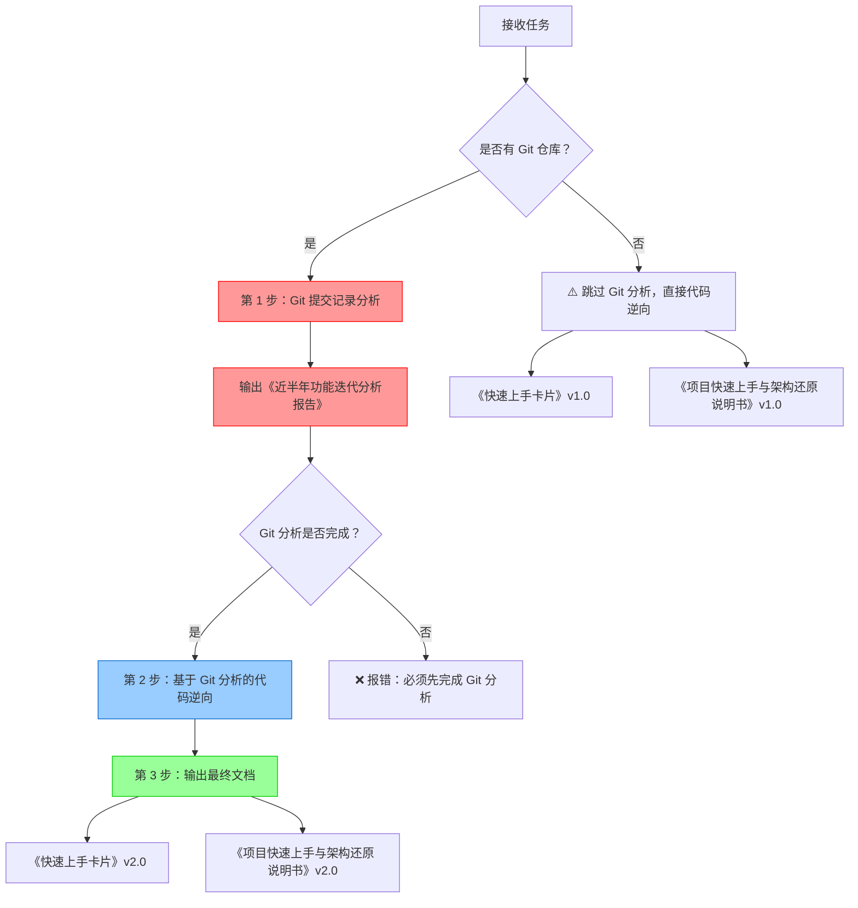

# 存量项目快速上手技能 (Quick Onboarding Skill) v2.0

## 技能概述

专门针对存量项目的逆向解析技能，**强制要求先分析 Git 提交记录了解近半年功能迭代**，然后进行代码逆向解析，帮助开发人员快速理解项目目的、核心功能和关键架构。

## 核心原则

### ⭐ Git 分析前置原则（强制）
**在任何代码分析之前，必须先分析 Git 提交记录**

为什么 Git 分析前置？
1. **📊 真实反映演进**: Git 记录是最真实的功能演进历史
2. **🔍 识别风险**: 从提交模式（Revert、集中提交、试飞构建）识别质量问题
3. **📈 把握趋势**: 了解功能发展方向，知道哪些是新功能、哪些是传统功能
4. **🎯 精准分析**: 基于 Git 识别的重点需求，有针对性地进行代码逆向

### 🔄 双轮驱动分析方法
- **Git 分析** → 识别重点需求和新增模块
- **代码逆向** → 验证和补充技术细节
- **相互印证** → 提高分析准确性

## 工作流程（强制顺序）



### 第 1 步：Git 提交记录分析（10 分钟，强制）⭐⭐⭐

1. 检查 Git 仓库：`git status`
2. 获取近半年提交记录
3. 统计分析（提交次数、需求分布、月度节奏）
4. 识别 TOP 5 重点需求
5. 分析每个重点需求的变更文件
6. 推断新增模块和数据表
7. 识别风险信号（Revert、集中提交等）
8. **输出《近半年功能迭代分析报告》**

### 第 2 步：基于 Git 分析的代码逆向（20 分钟）

1. **优先分析** Git 报告中识别的新增模块
2. **验证** Git 报告中推断的数据表和类
3. **补充** Git 报告中缺失的技术细节
4. **更新**架构图和数据流图（标注新增模块）
5. **编写**典型业务流程（新增功能优先）

### 第 3 步：输出最终文档（融入 Git 分析结果）

1. **《快速上手卡片》v2.0**: 所有功能标注新增时间
2. **《项目快速上手与架构还原说明书》v2.0**: 
   - 第 1 章增加"近半年功能迭代概览"
   - 第 3 章每个新增模块单独成节，包含需求背景
   - 第 9 章风险识别基于 Git 分析结果

## 输出文档

### 必须输出的 3 份文档

1. **《近半年功能迭代分析报告》** （基于 Git）
   - 迭代概览（时间跨度、提交统计、主要需求清单）
   - 月度迭代节奏
   - TOP 5 重点需求详细分析
   - 功能演进趋势
   - 技术架构演进
   - 代码质量分析
   - 发展建议

2. **《快速上手卡片》v2.0**
   - 核心功能清单（标注新增时间）
   - 代码结构树（标注新增模块）
   - 数据表清单
   - 业务流程图
   - 风险点预警

3. **《项目快速上手与架构还原说明书》v2.0**
   - 近半年功能迭代概览
   - 完整技术架构还原
   - 核心业务逻辑详解
   - 数据持久化层分析
   - 代码质量评估
   - 风险识别与重构建议

## 质量标准

### 时间要求
- **Git 分析**: 10 分钟内完成
- **代码逆向**: 20 分钟内完成
- **总计**: 30 分钟内完成所有分析和文档输出

### 内容要求（强制）
- ✅ **必须**先输出《近半年功能迭代分析报告》
- ✅ **必须**基于 Git 分析结果进行代码逆向
- ✅ **必须**在最终文档中标注新增功能和传统功能
- ✅ **必须**包含项目目的的一句话总结
- ✅ **必须**列出 TOP 3-5 核心功能（区分新增和传统）
- ✅ **必须**提供可执行的启动步骤
- ✅ **必须**指出常见的坑和注意事项

### 禁止事项
- ❌ **禁止**跳过 Git 分析直接进行代码逆向（有 Git 仓库的情况下）
- ❌ **禁止**输出不包含 Git 分析结果的文档
- ❌ **禁止**在文档中不标注新增功能
- ❌ 不要过度深入细节
- ❌ 不要罗列所有文件
- ❌ 不要忽略环境配置说明

## 使用示例

### 场景：新成员接手项目

**用户请求**:
```
快速上手分析 <项目路径>
```

**执行流程**:

1. **确认路径**（使用 confirm-before-analyze 技能）
   ```
   收到！在开始逆向分析之前，请确认以下信息：
   
   📁 **代码目录**: `<项目路径>`
   📂 **文档输出目录**: `<项目路径>/docs`
   
   确认后我将立即开始...
   ```

2. **检查 Git 仓库**
   ```bash
   cd <项目路径>
   git status  # ✅ 有 Git 仓库
   ```

3. **执行 Git 分析**（第 1 步）
   ```bash
   # 获取提交记录
   git log --since="6 months ago" --oneline > docs/git_commits.txt
   
   # 统计分析
   # 识别重点需求：#XXXXXXX(XX 次), #XXXXXXX(XX 次), ...
   
   # 输出报告
   生成 docs/近半年功能迭代分析报告.md
   ```

4. **基于 Git 分析进行代码逆向**（第 2 步）
   - 重点分析 Git 报告中识别的新增模块
   - 验证 Git 报告中推断的数据表
   - 补充技术细节

5. **输出最终文档**（第 3 步）
   - 《快速上手卡片》v2.0
   - 《项目快速上手与架构还原说明书》v2.0

**交付物**:
```
docs/
├── 近半年功能迭代分析报告.md       # ⭐新增（必须）
├── 快速上手卡片.md                 # v2.0（标注新增）
└── 项目快速上手与架构还原说明书.md # v2.0（包含迭代历史）
```

## 模板文件

本技能提供标准文档模板，位于 `templates/` 目录：

- `templates/近半年功能迭代分析报告.md` - Git 分析报告模板
- `templates/项目快速上手与架构还原说明书.md` - 完整架构文档模板

使用时复制模板并填充实际内容。

## 与其他技能的协同

### 与 confirm-before-analyze 技能配合


**流程**:
1. **confirm-before-analyze**: 确认代码目录和文档输出目录
2. **quick-onboarding**: 执行 Git 分析和代码逆向
3. **输出文档**: 到确认的目录

## 检查清单

### 开始前的检查
- [ ] 确认项目路径正确
- [ ] 检查是否存在 Git 仓库
- [ ] 确认 docs 目录存在（或创建）

### Git 分析完成的验证
- [ ] ✅ 已输出《近半年功能迭代分析报告》
- [ ] ✅ 报告中包含提交统计数据
- [ ] ✅ 报告中识别了至少 3 个重点需求
- [ ] ✅ 报告中分析了功能演进趋势
- [ ] ✅ 报告中识别了潜在风险点

### 代码逆向完成的验证
- [ ] ✅ 已重点分析 Git 报告中的新增模块
- [ ] ✅ 已验证 Git 报告中推断的数据表
- [ ] ✅ 已补充 Git 报告中缺失的技术细节
- [ ] ✅ 已更新架构图和数据流图

### 文档输出的验证
- [ ] ✅ 已输出《快速上手卡片》v2.0
- [ ] ✅ 文档中标注了新增功能和传统功能
- [ ] ✅ 已输出《项目快速上手与架构还原说明书》v2.0
- [ ] ✅ 文档中包含近半年迭代历史

## 故障排查

### Q1: 项目没有 Git 仓库怎么办？
**A**: 跳过 Git 分析步骤，直接进行代码逆向，输出 v1.0 版本文档，并在文档开头注明"项目无 Git 仓库，无法分析功能迭代历史"。

### Q2: Git 仓库是空的或提交记录很少怎么办？
**A**: 如果提交记录<10 条，在 Git 分析报告中注明"项目刚启动或 Git 仓库刚初始化，提交记录不足以分析功能演进"，然后继续进行代码逆向。

### Q3: Git 分析耗时过长怎么办？
**A**: 限制分析的提交数量（如最近 100 条），优先分析 commit message 中包含需求编号的提交。

### Q4: 无法从 Git 提交识别需求编号怎么办？
**A**: 按文件变更路径分组，推断功能模块，在报告中注明"提交记录未包含需求编号，按文件变更推断功能模块"。

---

## 维护者

**版本**: v2.0  
**最后更新**: 2026-03-19  
**维护者**: Legacy Code Reader Agent

## 更新记录

| 版本 | 日期 | 更新内容 |
|------|------|----------|
| v2.0 | 2026-03-19 | **重大更新**：<br/>- 强制要求先分析 Git 提交记录<br/>- 新增《近半年功能迭代分析报告》<br/>- 更新工作流程为 3 步<br/>- 更新质量标准和禁止事项<br/>- 新增检查清单 |
| v1.0 | 2026-03-19 | 初始版本 |
