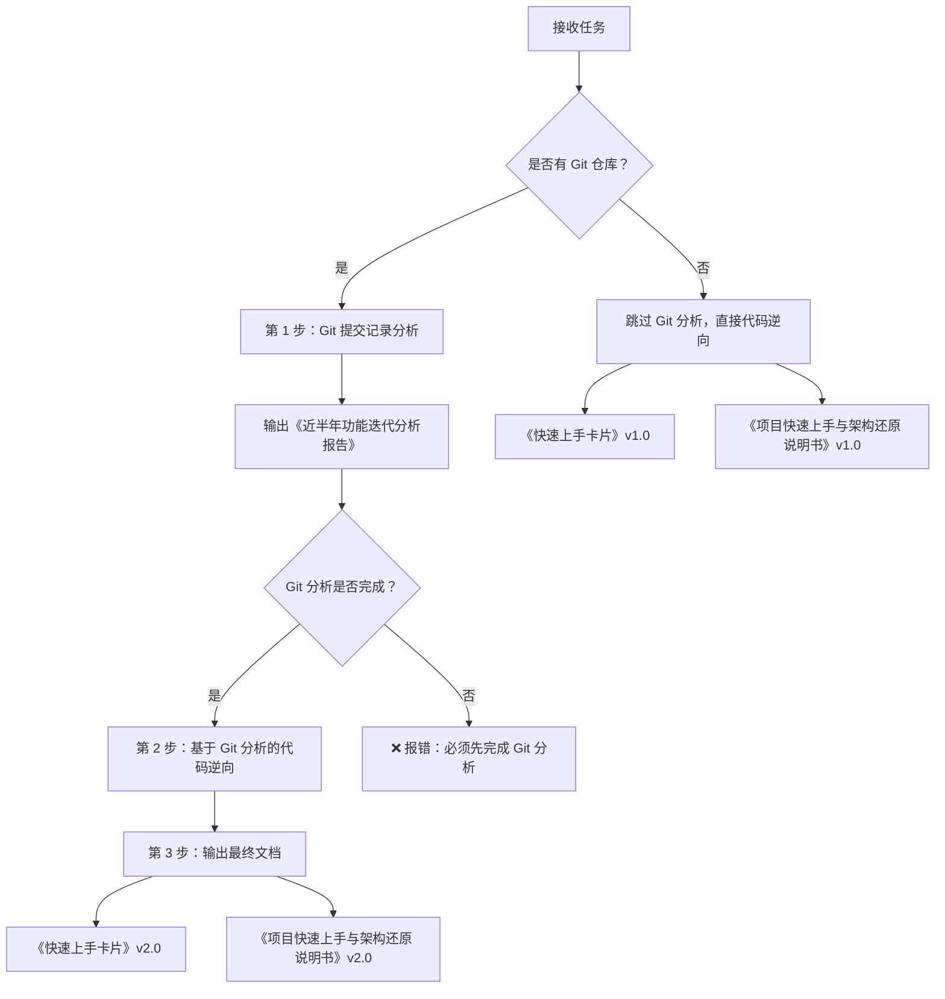

# 存量项目快速上手技能 (Quick Onboarding Skill) v2.0

## 技能描述
专门针对存量项目的逆向解析技能，**强制要求先分析 Git 提交记录了解近半年功能迭代**，然后进行代码逆向解析，帮助开发人员快速理解项目目的、核心功能和关键架构。

## ⚠️ 重要前置条件

### 必须执行的步骤（顺序不可颠倒）

#### 第 1 步：Git 提交记录分析（必须）⭐⭐⭐
**在执行任何代码分析之前，必须先完成此步骤**

```bash
# 1. 检查是否存在 Git 仓库
cd <项目路径>
git status

# 2. 获取近半年提交记录（默认 6 个月）
git log --since="6 months ago" --until="now" --pretty=format:"%h|%ad|%s" --date=short > docs/git_commits_last_6months.txt

# 3. 分析提交记录
- 统计提交次数
- 识别主要需求（通过 commit message 中的需求编号）
- 分析月度迭代节奏
- 识别重点需求（提交次数最多的前 3 个）
- 推断新增模块和功能
- 识别潜在风险（Revert 操作、集中提交等）

# 4. 输出《近半年功能迭代分析报告》
必须包含：
- 迭代概览（时间跨度、提交统计、主要需求清单）
- 月度迭代节奏
- TOP 5 重点需求详细分析（需求背景、涉及模块、核心功能、技术亮点）
- 功能演进趋势
- 技术架构演进（新增组件、新增数据表推断）
- 代码质量分析（提交模式、潜在风险）
- 发展建议
```

**输出文档**: `docs/近半年功能迭代分析报告.md`

**验证标准**: 
- ✅ 必须有 Git 提交记录的统计数据
- ✅ 必须识别出至少 3 个重点需求
- ✅ 必须分析出功能演进趋势
- ✅ 必须识别潜在风险点

#### 第 2 步：基于 Git 分析的代码逆向解析
**只有在完成第 1 步后，才能执行此步骤**

基于 Git 分析报告中识别的重点需求和新增模块，有针对性地进行代码逆向解析：
- 重点分析 Git 报告中识别的新增模块
- 验证 Git 报告中推断的数据表
- 补充 Git 报告中缺失的技术细节
- 更新架构图和数据流图

#### 第 3 步：输出最终文档
基于前两步的分析结果，输出：
- 《快速上手卡片》（v2.0 格式，标注新增功能）
- 《项目快速上手与架构还原说明书》（v2.0 格式，包含迭代历史）

---

## 适用场景
- 新成员接手维护旧项目（**必须先看 Git 迭代历史**）
- 跨团队项目交接（**必须提供近半年功能迭代报告**）
- 技术尽职调查（**必须分析功能演进趋势**）
- 项目重构前的现状分析（**必须识别技术债务累积过程**）
- 多项目并行开发时的上下文切换

## 核心目标
**在 30 分钟内让开发人员理解项目的核心价值和技术要点，并清楚了解近半年的功能演进历程**

## 工作流程（强制顺序）



### 第 1 步：Git 提交记录分析（详细步骤）

#### 1.1 检查 Git 仓库
```bash
cd <项目路径>
git status
```
- 如果失败 → 项目无 Git 仓库，跳过此步骤，直接进入代码逆向
- 如果成功 → 继续下一步

#### 1.2 获取近半年提交记录
```bash
# 获取原始提交记录
git log --since="6 months ago" --until="now" --name-only --pretty=format:"COMMIT:%h|%ad|%s" --date=short > docs/git_commits_raw.txt

# 获取简化版提交记录（用于统计）
git log --since="6 months ago" --until="now" --oneline > docs/git_commits_oneline.txt
```

#### 1.3 统计分析
```bash
# 总提交次数
git log --since="6 months ago" --until="now" --oneline | wc -l

# 按需求编号分组统计（假设 commit message 包含 #需求编号）
git log --since="6 months ago" --until="now" --grep="#[0-9]" --oneline

# 按月统计
git log --since="6 months ago" --until="now" --format="%ad" --date=short | cut -d'-' -f1,2 | sort | uniq -c
```

#### 1.4 识别重点需求
基于提交次数排序，识别 TOP 5 重点需求：
- 提取 commit message 中的需求编号（如 #11744402）
- 统计每个需求的提交次数
- 按提交次数降序排列
- 选取前 3-5 个作为重点需求

#### 1.5 分析每个重点需求
对于每个重点需求：
1. **提取相关提交**: `git log --grep="#需求编号"`
2. **查看变更文件**: `git show --name-only <commit-hash>`
3. **推断功能模块**: 根据文件路径判断所属模块
4. **识别新增类**: 根据文件名判断新增的 Controller/Service/DAO
5. **推断数据表**: 根据实体类名推断新增数据表

#### 1.6 识别风险点
基于 Git 提交模式识别风险：
- **Revert 操作**: `git log --grep="Revert"` → 质量问题
- **集中提交**: 单日提交>10 次 → 赶工迹象
- **试飞构建**: commit message 包含"试飞" → 测试不足
- **长期未合并**: 分支存在超过 2 周 → 集成风险

#### 1.7 输出 Git 分析报告
必须包含以下章节：
1. 迭代概览（时间跨度、提交统计、主要需求清单）
2. 月度迭代节奏
3. TOP 5 重点需求详细分析
4. 功能演进趋势
5. 技术架构演进
6. 代码质量分析
7. 发展建议

---

## 分析维度（在 Git 分析基础上深化）

### 1. 项目定位与业务价值（结合 Git 分析）
- **项目目的是什么？** - 用一句话概括
- **近半年新增了哪些业务能力？** - 基于 Git 分析回答
- **核心功能演进历程？** - 基于 Git 分析回答

### 2. 技术栈快照（区分传统和新增）
- **传统技术栈** - 一直存在的技术
- **新增技术组件** - 基于 Git 分析识别（如 2026-01 新增线程池配置）

### 3. 代码结构地图（标注新增模块）
```
项目根目录/
├── src/main/java/.../
│   ├── traditional-module/      # 传统模块
│   ├── new-module-2025-11/      # ⭐NEW 2025-11 新增
│   └── new-module-2026-01/      # ⭐NEW 2026-01 新增
```

### 4. 关键入口点识别（优先新增模块）
- **新增 Controller** - 基于 Git 分析识别
- **新增 Service** - 基于 Git 分析识别
- **传统入口点** - 补充完整

### 5. 数据流与核心逻辑（重点新增功能）
- **新增功能的业务流程** - 基于 Git 分析 + 代码验证
- **传统功能的优化点** - 基于 Git 分析识别

---

## 输出格式（v2.0）

### 文档 1: 《近半年功能迭代分析报告》（新增，必须）

```markdown
# [项目名称] - 近半年功能迭代分析报告

> **分析日期**: YYYY-MM-DD  
> **分析范围**: YYYY-MM 至 YYYY-MM（近 6 个月）  
> **数据来源**: Git 提交记录  

## 📊 迭代概览
- 时间跨度
- 提交统计
- 主要需求清单（表格）

## 📅 月度迭代节奏
- 每月需求数和工作重点

## 🔍 TOP 5 重点需求详细分析
每个需求包含：
- 需求背景和编号
- 提交次数和时间范围
- 涉及模块和核心类
- 核心功能
- 技术亮点
- 迭代过程

## 📈 功能演进趋势
- 从 Git 视角看功能发展方向

## 🏗️ 技术架构演进
- 新增组件
- 新增数据表推断
- 工具类增强

## 📊 代码质量分析
- 提交模式分析
- 潜在风险识别

## 💡 发展建议
- 短期、中期、长期建议
```

### 文档 2: 《快速上手卡片》（v2.0 格式）

在 v1.0 基础上增加：
- ✅ 核心功能标注新增时间（如"智能质检强管控 ⭐NEW 2026-01"）
- ✅ 代码结构标注新增模块（如"├── satisfactionanalyze/ ⭐NEW 2026-01"）
- ✅ 技术栈标注新增组件（如"线程池配置 ⭐NEW 2026-01"）
- ✅ 典型业务流程增加新增功能的流程图
- ✅ 注意事项增加新增功能的注意点
- ✅ 学习路径考虑新增功能的学习时间

### 文档 3: 《项目快速上手与架构还原说明书》（v2.0 格式）

在 v1.0 基础上增加：
- ✅ 第 1 章增加"近半年功能迭代概览"小节
- ✅ 第 2 章技术栈区分传统和新增
- ✅ 第 3 章每个新增模块单独成节，包含需求背景（Git 分析结果）
- ✅ 第 4 章数据模型增加"推断的新增数据表"小节
- ✅ 第 5 章 API 接口区分传统和新增
- ✅ 第 9 章风险识别基于 Git 分析结果
- ✅ 第 10 章增加文档更新记录（v2.0 说明）

---

## 质量标准（v2.0）

### 时间要求
- **Git 分析**: 10 分钟内完成
- **代码逆向**: 20 分钟内完成
- **总计**: 30 分钟内完成所有分析和文档输出

### 内容要求（强制）
- ✅ **必须**先输出《近半年功能迭代分析报告》
- ✅ **必须**基于 Git 分析结果进行代码逆向
- ✅ **必须**在最终文档中标注新增功能和传统功能
- ✅ **必须**包含项目目的的一句话总结
- ✅ **必须**列出 TOP 3-5 核心功能（区分新增和传统）
- ✅ **必须**提供可执行的启动步骤
- ✅ **必须**指出常见的坑和注意事项

### 禁止事项（v2.0 新增）
- ❌ **禁止**跳过 Git 分析直接进行代码逆向（有 Git 仓库的情况下）
- ❌ **禁止**输出不包含 Git 分析结果的文档
- ❌ **禁止**在文档中不标注新增功能
- ❌ 不要过度深入细节
- ❌ 不要罗列所有文件
- ❌ 不要忽略环境配置说明

---

## 与其他技能的区别

| 技能 | 深度 | 时间 | 输出 | 适用场景 | 前置条件 |
|------|------|------|------|----------|----------|
| **快速上手 v2.0** | ⭐⭐ | 30 分钟 | 3 份文档 | 新人入门、项目交接 | **必须先分析 Git** |
| **深度逆向** | ⭐⭐⭐⭐⭐ | 4-8 小时 | 完整文档 | 重构、迁移、深度优化 | 可选 Git 分析 |
| **安全审计** | ⭐⭐⭐⭐ | 2-4 小时 | 风险报告 | 安全合规检查 | 无需 Git 分析 |

---

## 示例输出流程

### 场景：新成员接手项目

**用户请求**:
```
快速上手分析 <项目路径>
```

**执行流程**:

1. **检查 Git 仓库**
   ```bash
   cd <项目路径>
   git status  # ✅ 有 Git 仓库
   ```

2. **执行 Git 分析**（第 1 步）
   ```bash
   # 获取提交记录
   git log --since="6 months ago" --oneline > docs/git_commits.txt
   
   # 统计分析
   # 识别重点需求：#XXXXXXX(XX 次), #XXXXXXX(XX 次), ...
   
   # 输出报告
   生成 docs/近半年功能迭代分析报告.md
   ```

3. **基于 Git 分析进行代码逆向**（第 2 步）
   - 重点分析 Git 报告中识别的新增模块（质检强管控、反向派单等）
   - 验证 Git 报告中推断的数据表
   - 补充技术细节

4. **输出最终文档**（第 3 步）
   - 《快速上手卡片》v2.0（标注新增功能）
   - 《项目快速上手与架构还原说明书》v2.0

**交付物**:
```
docs/
├── 近半年功能迭代分析报告.md       # ⭐新增（必须）
├── 快速上手卡片.md                 # v2.0（标注新增）
└── 项目快速上手与架构还原说明书.md # v2.0（包含迭代历史）
```

---

## 检查清单（执行前必读）

### 开始前的检查
- [ ] 确认项目路径正确
- [ ] 检查是否存在 Git 仓库
- [ ] 确认 docs 目录存在（或创建）

### Git 分析完成的验证
- [ ] ✅ 已输出《近半年功能迭代分析报告》
- [ ] ✅ 报告中包含提交统计数据
- [ ] ✅ 报告中识别了至少 3 个重点需求
- [ ] ✅ 报告中分析了功能演进趋势
- [ ] ✅ 报告中识别了潜在风险点

### 代码逆向完成的验证
- [ ] ✅ 已重点分析 Git 报告中的新增模块
- [ ] ✅ 已验证 Git 报告中推断的数据表
- [ ] ✅ 已补充 Git 报告中缺失的技术细节
- [ ] ✅ 已更新架构图和数据流图

### 文档输出的验证
- [ ] ✅ 已输出《快速上手卡片》v2.0
- [ ] ✅ 文档中标注了新增功能和传统功能
- [ ] ✅ 已输出《项目快速上手与架构还原说明书》v2.0
- [ ] ✅ 文档中包含近半年迭代历史

---

## 故障排查

### Q1: 项目没有 Git 仓库怎么办？
**A**: 跳过 Git 分析步骤，直接进行代码逆向，输出 v1.0 版本文档，并在文档开头注明"项目无 Git 仓库，无法分析功能迭代历史"。

### Q2: Git 仓库是空的或提交记录很少怎么办？
**A**: 如果提交记录<10 条，在 Git 分析报告中注明"项目刚启动或 Git 仓库刚初始化，提交记录不足以分析功能演进"，然后继续进行代码逆向。

### Q3: Git 分析耗时过长怎么办？
**A**: 限制分析的提交数量（如最近 100 条），优先分析 commit message 中包含需求编号的提交。

### Q4: 无法从 Git 提交识别需求编号怎么办？
**A**: 按文件变更路径分组，推断功能模块，在报告中注明"提交记录未包含需求编号，按文件变更推断功能模块"。

---

## 维护者
Legacy Code Reader Agent  
最后更新：2026-03-19  
版本：v2.0（强制 Git 分析前置）

## 更新记录
| 版本 | 日期 | 更新内容 |
|------|------|----------|
| v2.0 | 2026-03-19 | **重大更新**：<br/>- 强制要求先分析 Git 提交记录<br/>- 新增《近半年功能迭代分析报告》<br/>- 更新工作流程为 3 步<br/>- 更新质量标准和禁止事项<br/>- 新增检查清单 |
| v1.0 | 2026-03-19 | 初始版本 |
