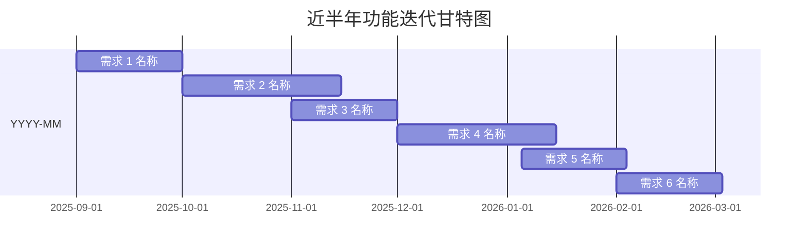
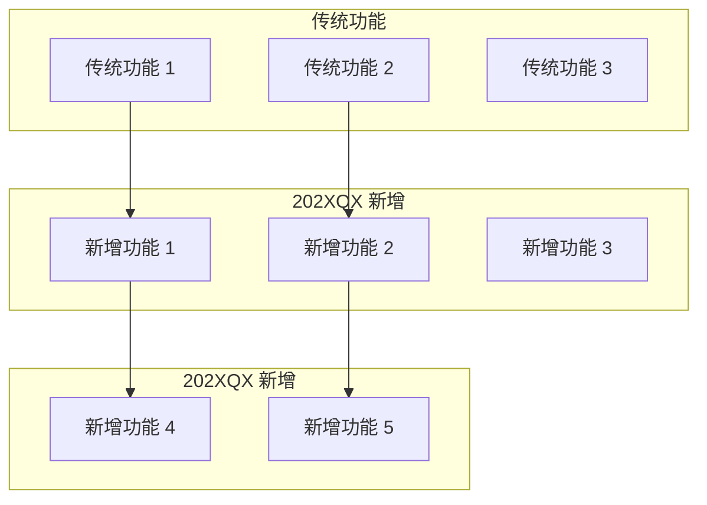

# [项目名称] - 近半年功能迭代分析报告

> **分析日期**: YYYY-MM-DD  
> **分析范围**: YYYY-MM 至 YYYY-MM（近 6 个月）  
> **数据来源**: Git 提交记录  
> **分析师**: [分析师姓名/智能体名称]

---

## 📊 一、迭代概览

### 1.1 提交统计

| 指标 | 数值 |
|------|------|
| **总提交次数** | XX 次 |
| **涉及需求数** | XX 个主要需求 |
| **平均提交频率** | 约 XX 次/月 |
| **最新提交** | [commit-hash] (提交信息) |
| **最早提交** | [commit-hash] (提交信息) |

### 1.2 TOP 10 重点需求（按提交次数）

| 排名 | 需求编号 | 提交次数 | 需求名称 | 时间范围 |
|------|----------|----------|----------|----------|
| 1 | #XXXXXXX | XX 次 | [需求名称] | YYYY-MM |
| 2 | #XXXXXXX | XX 次 | [需求名称] | YYYY-MM |
| 3 | #XXXXXXX | XX 次 | [需求名称] | YYYY-MM |
| 4 | #XXXXXXX | XX 次 | [需求名称] | YYYY-MM |
| 5 | #XXXXXXX | XX 次 | [需求名称] | YYYY-MM |
| 6 | #XXXXXXX | XX 次 | [需求名称] | YYYY-MM |
| 7 | #XXXXXXX | XX 次 | [需求名称] | YYYY-MM |
| 8 | #XXXXXXX | XX 次 | [需求名称] | YYYY-MM |
| 9 | #XXXXXXX | XX 次 | [需求名称] | YYYY-MM |
| 10 | #XXXXXXX | XX 次 | [需求名称] | YYYY-MM |

---

## 📅 二、月度迭代节奏



**迭代特点分析**:
- **YYYY-MM~MM**: [阶段特点，如：基础能力建设期]
- **YYYY-MM~MM**: [阶段特点，如：功能增强期]
- **YYYY-MM~MM**: [阶段特点，如：集中交付期]
- **YYYY-MM~MM**: [阶段特点，如：优化完善期]

---

## 🔍 三、TOP 5 重点需求详细分析

### 3.1 #XXXXXXX [需求名称]（XX 次提交）⭐⭐⭐

**需求背景**: [简要描述需求来源和业务诉求]

**涉及模块**:
- `模块路径 1` - [模块说明]
- `模块路径 2` - [模块说明]

**核心变更文件**:
```
文件路径 1.java          # [文件用途说明]
文件路径 2.java          # [文件用途说明]
文件路径 3.html/js/css   # [前端文件说明]
```

**推断新增功能**:
- ✅ [新增功能点 1]
- ✅ [新增功能点 2]
- ✅ [新增功能点 3]

**推断新增数据表**:
- ✅ `表名` - [表用途]（证据：DAO 文件变更）

**技术亮点**:
- [技术亮点 1，如：分层架构清晰]
- [技术亮点 2，如：引入新技术组件]
- [技术亮点 3，如：性能优化措施]

**迭代过程**:
- YYYY-MM-DD: 首次提交，开始开发
- YYYY-MM-DD: 完成核心功能
- YYYY-MM-DD: Merge Request 合并

---

### 3.2 #XXXXXXX [需求名称]（XX 次提交）⭐⭐⭐

**需求背景**: [简要描述需求来源和业务诉求]

**涉及模块**:
- `模块路径 1`
- `模块路径 2`

**核心变更文件**:
```
[文件列表]
```

**推断新增功能**:
- ✅ [功能列表]

**推断新增数据表**:
- ✅ `表名` - [用途]

**技术亮点**:
- [亮点列表]

---

### 3.3 #XXXXXXX [需求名称]（XX 次提交）⭐⭐

**需求背景**: [简要描述]

**涉及模块**: [...]

**核心变更文件**: [...]

**推断新增功能**: [...]

**风险信号**: ⚠️ [如：存在 Revert 提交/试飞构建等]

---

### 3.4 #XXXXXXX [需求名称]（XX 次提交）⭐

**需求背景**: [...]

**涉及模块**: [...]

**核心变更文件**: [...]

**推断新增功能**: [...]

---

### 3.5 #XXXXXXX [需求名称]（XX 次提交）⭐

**需求背景**: [...]

**涉及模块**: [...]

**核心变更文件**: [...]

**推断新增功能**: [...]

---

## 📈 四、功能演进趋势

### 4.1 业务方向演进



**演进特点**:
1. **从 X 到 Y**: [描述演进方向]
2. **从单一到综合**: [描述能力扩展]
3. **从人工到智能**: [描述自动化程度提升]
4. **技术栈持续升级**: [描述新技术引入]

### 4.2 技术架构演进

**新增组件**:
- ✅ `组件名` - [用途]（引入时间，需求编号）
- ✅ `工具类` - [用途]（引入时间，需求编号）

**推断新增数据表**:
- ✅ `表名 1` - [用途]（需求编号）
- ✅ `表名 2` - [用途]（需求编号）

**技术栈变化**:
| 技术 | 传统版本 | 新增版本 | 引入时间 |
|------|----------|----------|----------|
| [技术名] | X.X | Y.Y | YYYY-MM |

---

## 📊 五、代码质量分析

### 5.1 提交模式分析

| 指标 | 数值 | 风险评估 |
|------|------|----------|
| **Revert 提交** | X 次 | 🟠/🟢 [风险等级] |
| **试飞构建** | X 次 | 🟠/🟢 [风险等级] |
| **集中提交** | XX 次/天（峰值） | 🟢/🟡 [是否正常] |
| **单次需求平均提交** | X.X 次 | 🟢 健康 |
| **Merge Request 数量** | XX 个 | [代码审查情况] |

### 5.2 潜在风险识别

#### 🔴 高风险
- **[需求编号]**: [具体风险，如：出现 Revert 提交]
  - **分析**: [风险原因和影响]
  - **建议**: [应对措施]

#### 🟠 中风险
- **[需求编号]**: [具体风险，如：试飞构建频繁]
  - **分析**: [可能存在测试覆盖不足]
  - **建议**: [补充测试用例]

#### 🟡 低风险
- **[需求编号]**: [具体风险，如：集中交付期]
  - **分析**: [可能存在赶工情况]
  - **建议**: [加强代码审查]

---

## 💡 六、发展建议

### 6.1 短期建议（1-3 个月）

1. **针对 [需求编号] 开展代码审查**
   - **原因**: [具体原因]
   - **措施**: 
     - Code Review 重点审查
     - 补充单元测试（覆盖率>80%）
     - 压力测试验证
   - **工作量**: X 人天

2. **为试飞构建功能补充测试**
   - **范围**: [需求列表]
   - **措施**: 编写单元测试、集成测试
   - **工作量**: X 人天

### 6.2 中期建议（3-6 个月）

1. **[改进项名称]**
   - **原因**: [为什么要做]
   - **方案**: [技术方案概述]
   - **工作量**: X 人天

2. **[改进项名称]**
   - **原因**: [...]
   - **方案**: [...]
   - **工作量**: X 人天

### 6.3 长期建议（6-12 个月）

1. **[架构改造项]**
   - **目标**: [预期目标]
   - **收益**: [带来的好处]
   - **工作量**: X 人天

2. **[能力建设项]**
   - **目标**: [...]
   - **收益**: [...]
   - **工作量**: X 人天

---

## 📋 七、总结

### 7.1 核心成果

✅ **近半年完成 XX 个主要需求，XX 次提交**  
✅ **建成 [核心能力 1]、[核心能力 2]、[核心能力 3]**  
✅ **支持 [新技术场景 1]、[新技术场景 2]**  
✅ **[其他重要成果]**

### 7.2 主要风险

⚠️ **[风险 1]**: [简要描述]  
⚠️ **[风险 2]**: [简要描述]  
⚠️ **[风险 3]**: [简要描述]

### 7.3 下一步行动

1. 📋 [待办事项 1]
2. 📋 [待办事项 2]
3. 🔍 [待办事项 3]
4. ⚠️ [待办事项 4]

---

## 附录

### A. Git 命令参考

```bash
# 获取近半年提交记录
git log --since="6 months ago" --oneline

# 按需求编号统计
git log --since="6 months ago" --oneline | Select-String "#[0-9]+" | 
  ForEach-Object { $_.Matches.Value } | Group-Object | Sort-Object Count -Descending

# 查看特定需求的变更
git log --grep="#需求编号" --name-only --oneline

# 识别风险信号
git log --since="6 months ago" --oneline | Select-String "Revert"
git log --since="6 months ago" --oneline | Select-String "试飞"
```

### B. 术语表

| 术语 | 英文 | 说明 |
|------|------|------|
| [术语 1] | [English] | [说明] |
| [术语 2] | [English] | [说明] |

### C. 参考文档

- [相关文档 1](链接)
- [相关文档 2](链接)

---

**报告版本**: v1.0  
**生成时间**: YYYY-MM-DD HH:MM  
**分析师**: [姓名]  
**联系方式**: [邮箱/飞书]
