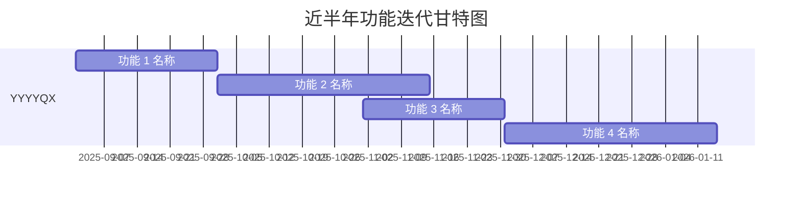
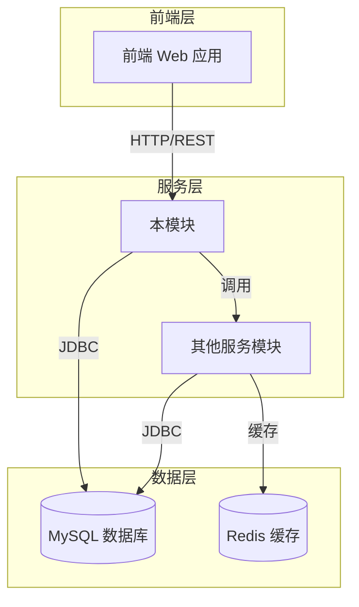
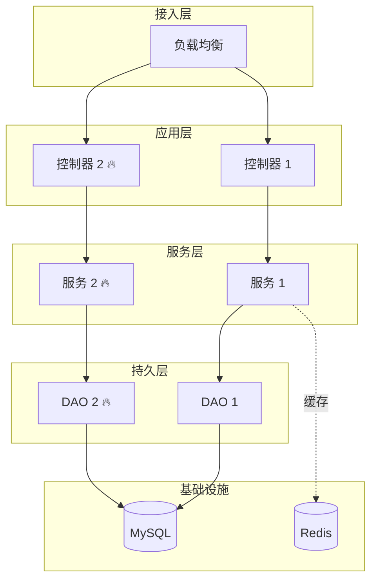
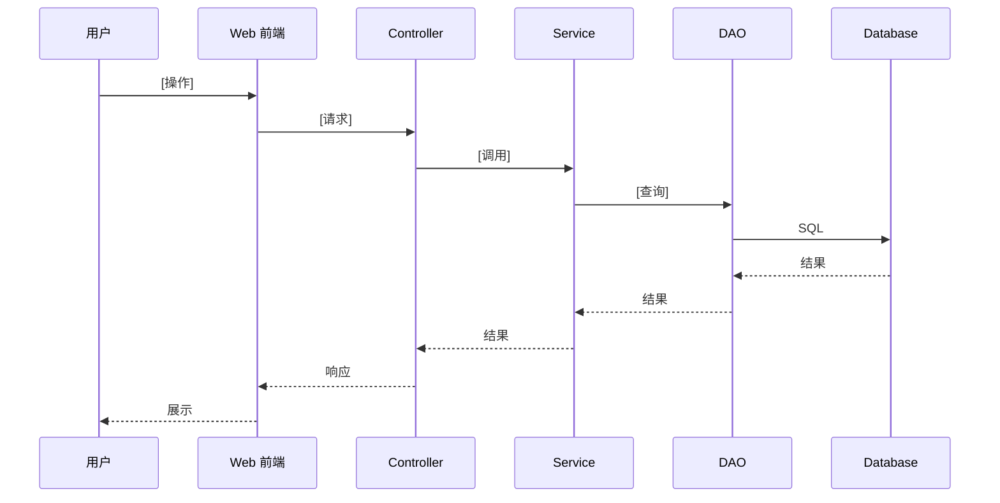
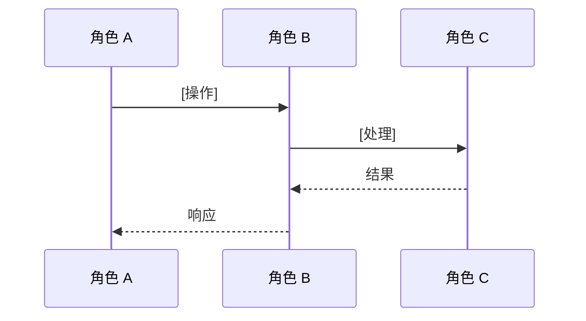
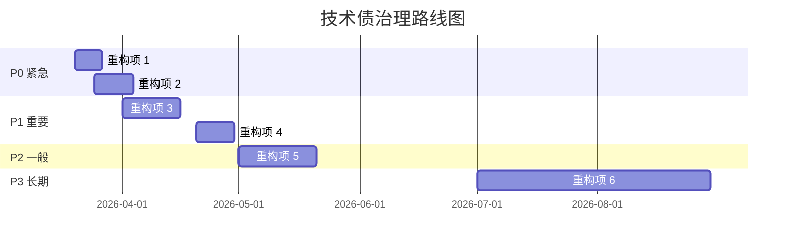

# 项目快速上手与架构还原说明书

**项目名称**: [项目名称]  
**模块路径**: [代码目录路径]  
**版本号**: v2.0（包含 Git 演进历史分析）  
**生成时间**: YYYY-MM-DD  
**密级**: [内部公开/机密]

---

## 目录

1. [近半年功能迭代概览](#第 1 章 - 近半年功能迭代概览) ⭐ NEW
2. [项目概述](#第 2 章 - 项目概述)
3. [技术架构](#第 3 章 - 技术架构)
4. [核心业务逻辑](#第 4 章 - 核心业务逻辑)
5. [数据持久化层](#第 5 章 - 数据持久化层)
6. [外部依赖](#第 6 章 - 外部依赖)
7. [典型业务流程](#第 7 章 - 典型业务流程)
8. [代码质量评估](#第 8 章 - 代码质量评估)
9. [风险识别与重构建议](#第 9 章 - 风险识别与重构建议)
10. [附录](#第 10 章 - 附录)

---

## 第 1 章 近半年功能迭代概览 ⭐ NEW

### 1.1 迭代统计

| 指标 | 数值 |
|------|------|
| **分析时间范围** | YYYY-MM-DD ~ YYYY-MM-DD |
| **总提交次数** | XX 次 |
| **涉及需求数** | XX 个主要需求 |
| **新增功能模块** | X 个 |
| **新增数据表（推断）** | X 个 |

### 1.2 TOP 5 重点需求

| 排名 | 需求编号 | 提交次数 | 功能名称 | 引入时间 |
|------|----------|----------|----------|----------|
| 1 | #XXXXXXX | XX 次 | [功能名称] | YYYY-MM |
| 2 | #XXXXXXX | XX 次 | [功能名称] | YYYY-MM |
| 3 | #XXXXXXX | XX 次 | [功能名称] | YYYY-MM |
| 4 | #XXXXXXX | XX 次 | [功能名称] | YYYY-MM |
| 5 | #XXXXXXX | XX 次 | [功能名称] | YYYY-MM |

### 1.3 功能演进里程碑



### 1.4 传统功能 vs 新增功能对比

| 维度 | 传统功能（YYYY-MM 前） | 新增功能（近半年） |
|------|----------------------|-------------------|
| **核心能力** | [能力列表] | [新增能力列表] |
| **技术栈** | [技术列表] | [新增技术组件] |
| **数据表** | [表数量] 张 | [新增表数量] 张 |
| **前端页面** | [页面列表] | [新增页面] |
| **性能** | [性能指标] | [性能优化点] |
| **代码质量** | [质量状况] | [新风险点] |

---

## 第 2 章 项目概述

### 2.1 模块定位

**[项目名称]** 是 [系统名称] 的核心模块，主要承担以下职责：

- ✅ [职责 1]
- ✅ [职责 2]
- ✅ [职责 3]
- 🔥 **新增**: [新增职责 1]（需求编号）
- 🔥 **新增**: [新增职责 2]（需求编号）

### 2.2 模块关系



### 2.3 技术栈

| 层级 | 技术选型 | 版本 | 备注 |
|------|----------|------|------|
| **框架** | [技术名] | X.X | [说明] |
| **ORM** | [技术名] | X.X | [说明] |
| **数据库** | [技术名] | X.X | [说明] |
| **缓存** | [技术名] | X.X | [说明] |
| **消息队列** | [技术名] | X.X | 🔥 新增 |
| **其他** | [技术名] | X.X | [说明] |

---

## 第 3 章 技术架构

### 3.1 整体架构图



### 3.2 分层架构说明

#### 3.2.1 Controller 层（控制器层）

**职责**: 接收 HTTP 请求，参数校验，调用 Service 层，返回响应

**核心类**:
- `[类名]` - [功能说明]
- `[类名 🔥]` - [功能说明]（需求编号）

#### 3.2.2 Service 层（业务逻辑层）

**职责**: 实现核心业务逻辑，事务控制，调用 DAO 层

**核心类**:
- `[类名]` - [功能说明]
- `[类名 🔥]` - [功能说明]（需求编号）

#### 3.2.3 DAO 层（数据访问层）

**职责**: 数据库 CRUD 操作，SQL 执行

**核心类**:
- `[类名]` - [功能说明]
- `[类名 🔥]` - [功能说明]（需求编号）

### 3.3 新增模块详解 🔥

#### 3.3.1 [模块名称]（需求编号）

**引入时间**: YYYY-MM  
**提交次数**: XX 次  
**核心文件**:
```
[文件列表]
```

**功能**:
- ✅ [功能点 1]
- ✅ [功能点 2]

**技术亮点**:
- [亮点 1]
- [亮点 2]

---

## 第 4 章 核心业务逻辑

### 4.1 [业务流程 1]

**入口**: `[Controller 方法]`

**流程**:
1. [步骤 1]
2. [步骤 2]
3. [步骤 3]

**关键 SQL**:
```sql
[SQL 语句]
```

### 4.2 [业务流程 2 🔥 NEW]

**入口**: `[Controller 方法]`

**流程**:
1. [步骤 1]
2. [步骤 2]

**关键代码**:
```java
[代码片段]
```

**⚠️ 风险点**:
- [风险说明]

---

## 第 5 章 数据持久化层

### 5.1 核心数据表结构

#### 5.1.1 [表名]（核心表）⭐

**用途**: [表用途说明]

**关键字段**:
| 字段名 | 类型 | 说明 | 示例 |
|--------|------|------|------|
| [字段 1] | [类型] | [说明] | [示例] |
| [字段 2] | [类型] | [说明] | [示例] |

**索引**:
- `PK_[表名]` ([字段])
- `IDX_[名称]` ([字段])

#### 5.1.2 [表名]（字典表）

**用途**: [表用途]

| 字段值 | 字段名 | 说明 |
|--------|--------|------|
| 1 | [名称] | [说明] |
| 2 | [名称] | [说明] |

### 5.2 🔥 新增数据表（推断）

#### 5.2.1 [表名]

**推断依据**: [DAO 文件变更/功能推断]（需求编号）  
**用途**: [表用途]

| 字段名 | 类型 | 说明 |
|--------|------|------|
| [字段 1] | [类型] | [说明] |
| [字段 2] | [类型] | [说明] |

### 5.3 ER 图

```mermaid
erDiagram
    表 1 ||--o{ 表 2 : "关系说明"
    表 1 ||--|| 表 3 : "关系说明"
    表 4 ||--o| 表 1 : "关系说明"
```

---

## 第 6 章 外部依赖

### 6.1 依赖清单

| 依赖 | 类型 | 用途 | 调用方式 |
|------|------|------|----------|
| [依赖名] | 内部模块 | [用途] | [调用方式] |
| [依赖名] | 数据库 | [用途] | JDBC |
| [依赖名] | 缓存 | [用途] | [客户端] |
| [依赖名 🔥] | 消息队列 | [用途] | [协议] |

### 6.2 关键依赖说明

#### 6.2.1 [内部模块名]

**提供的核心功能**:
- [功能 1]
- [功能 2]

#### 6.2.2 第三方 API

| API 名称 | 提供方 | 用途 | 调用频率 |
|----------|--------|------|----------|
| [API 名] | [提供方] | [用途] | [频率] |
| [API 名 🔥] | [提供方] | [用途] | [频率] |

---

## 第 7 章 典型业务流程

### 7.1 [流程名称 1]



### 7.2 [流程名称 2 🔥 NEW]



---

## 第 8 章 代码质量评估

### 8.1 代码结构评分

| 维度 | 评分 | 说明 |
|------|------|------|
| **分层清晰度** | ⭐⭐⭐⭐⭐ | [说明] |
| **命名规范** | ⭐⭐⭐⭐ | [说明] |
| **注释覆盖** | ⭐⭐⭐ | [说明] |
| **异常处理** | ⭐⭐⭐⭐ | [说明] |
| **事务管理** | ⭐⭐⭐⭐ | [说明] |
| **代码复用** | ⭐⭐⭐ | [说明] |

### 8.2 Git 提交质量分析

| 指标 | 数值 | 评估 |
|------|------|------|
| **单次需求平均提交** | X.X 次 | 🟢 健康 |
| **Revert 提交** | X 次 | 🟠 中等风险 |
| **试飞构建** | X 次 | 🟠 中等风险 |
| **集中提交峰值** | XX 次/天 | 🟢 正常 |
| **提交信息规范** | 🟢 良好 | [说明] |

### 8.3 技术债识别

#### 🔴 严重技术债

1. **[问题名称]** (`文件路径`)
   ```java
   [问题代码示例]
   ```
   **影响**: [影响说明]  
   **建议**: [改进建议]

#### 🟠 中等技术债

1. **[问题名称]**
   - **原因**: [原因说明]
   - **建议**: [改进建议]

#### 🟡 轻微技术债

1. **[问题名称]**
   - **建议**: [改进建议]

---

## 第 9 章 风险识别与重构建议

### 9.1 风险清单

| 风险点 | 位置 | 风险等级 | 触发条件 | 影响 | 建议措施 |
|--------|------|----------|----------|------|----------|
| [风险 1] | [位置] | 🔴 高 | [条件] | [影响] | [措施] |
| [风险 2] | [位置] | 🟠 中 | [条件] | [影响] | [措施] |
| [风险 3] | [位置] | 🟡 低 | [条件] | [影响] | [措施] |

### 9.2 重构建议（优先级排序）

#### P0 - 紧急（1 个月内完成）

1. **[重构项名称]**
   - **原因**: [为什么要做]
   - **措施**: 
     - [具体步骤 1]
     - [具体步骤 2]
   - **工作量**: X 人天

2. **[重构项名称]**
   - **原因**: [...]
   - **措施**: [...]
   - **工作量**: X 人天

#### P1 - 重要（3 个月内完成）

1. **[重构项名称]**
   - **原因**: [...]
   - **方案**: [...]
   - **工作量**: X 人天

#### P2 - 一般（6 个月内完成）

1. **[重构项名称]**
   - **原因**: [...]
   - **方案**: [...]
   - **工作量**: X 人天

#### P3 - 长期（6-12 个月）

1. **[重构项名称]**
   - **目标**: [...]
   - **收益**: [...]
   - **工作量**: X 人天

### 9.3 技术债治理路线图



---

## 第 10 章 附录

### 10.1 术语表

| 术语 | 英文 | 说明 |
|------|------|------|
| [术语 1] | [English] | [说明] |
| [术语 2] | [English] | [说明] |

### 10.2 参考文档

- [文档 1](链接)
- [文档 2](链接)
- [近半年功能迭代分析报告](./近半年功能迭代分析报告.md)
- [快速上手卡片](./快速上手卡片.md)

### 10.3 变更历史

| 版本 | 日期 | 变更内容 | 作者 |
|------|------|----------|------|
| v2.0 | YYYY-MM-DD | 新增 Git 演进历史分析、标注新增功能 | [姓名] |
| v1.0 | YYYY-MM-DD | 初始版本 | [姓名] |

---

## 📊 文档质量自检清单

- [ ] ✅ 已输出《近半年功能迭代分析报告》
- [ ] ✅ 报告中有提交统计数据
- [ ] ✅ 报告识别了至少 3 个重点需求
- [ ] ✅ 报告分析了功能演进趋势
- [ ] ✅ 报告识别了潜在风险点
- [ ] ✅ 代码逆向基于 Git 分析结果
- [ ] ✅ 最终文档标注了新增功能
- [ ] ✅ 输出了 3 份文档（v2.0 标准）

---

**文档版本**: v2.0  
**生成时间**: YYYY-MM-DD HH:MM  
**分析师**: [姓名]  
**联系方式**: [邮箱/飞书]
